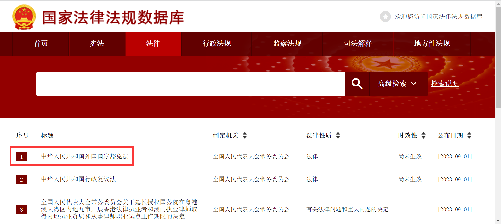
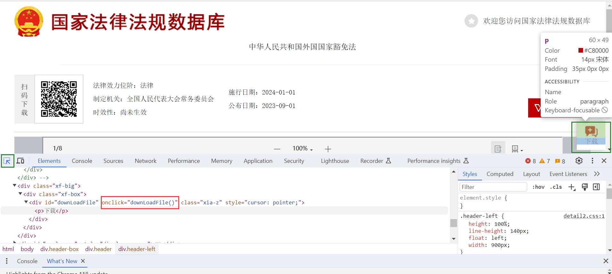
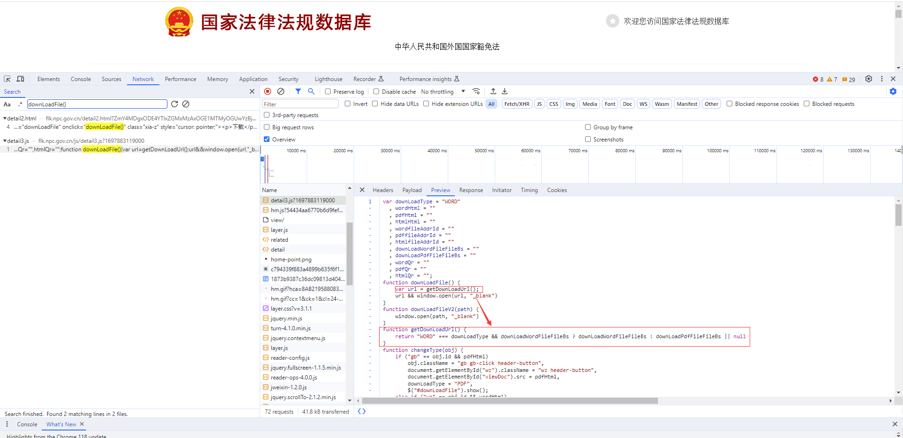
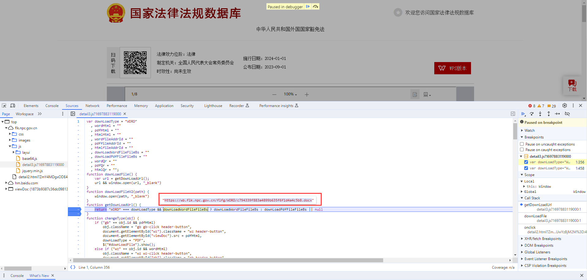
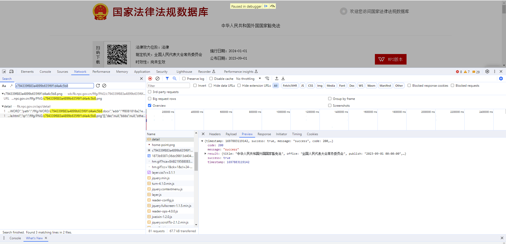
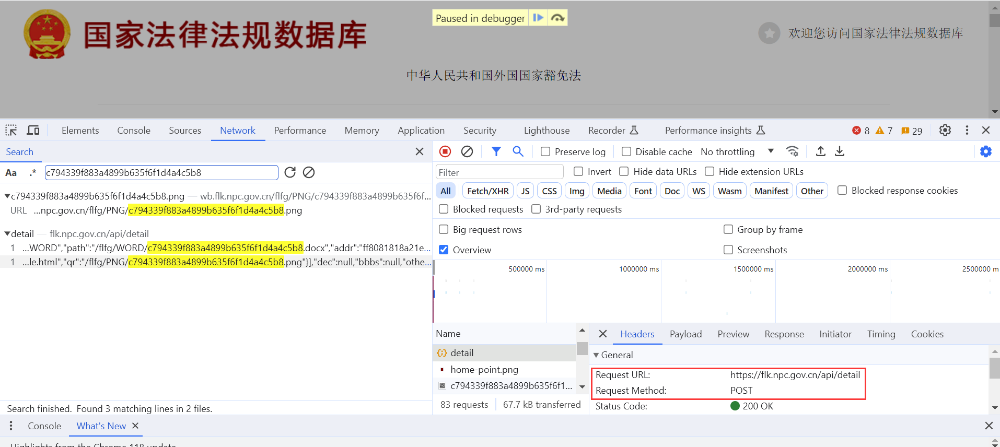
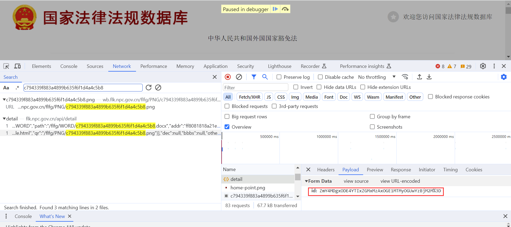

# LegalDoc-Scraper
In this project, I share my internship records at Fujian Zhimao Law Firm from August to October 2023. I utilized Python web scraping in conjunction with JavaScript reverse engineering to retrieve and download the required legal documents in bulk. This approach significantly increased work efficiency by several multiples.

# Environment Used

- Python 3.8
- Pycharm

# Modules Used
**requests**: A popular Python library for making HTTP requests
```bash
pip install requests
```

# Data Source Analysis
**The scraped website URL**: https://flk.npc.gov.cn/fl.html

**Developer Tools**: Analyzing packets to fetch dynamic or encrypted webpage information

- Navigate to the first title on the page. On the right, there's a 'Download' button. Clicking it will automatically initiate the download for the corresponding document



- Right-click and select 'Inspect' to locate the link method for the 'Download' button: downLoadFile()



> Refresh the webpage. Search for downLoadFile() within the 'Network' tab to locate the corresponding JS code



> Right-click and choose ‘Open in Sources panel’. By setting breakpoints and debugging, you can directly find the download link after clicking the 'Download' button: https://wb.flk.npc.gov.cn/flfg/WORD/c794339f883a4899b635f6f1d4a4c5b8.docx



> Search for the key term c794339f883a4899b635f6f1d4a4c5b8 within the 'Network' tab. This will allow you to directly locate the data packet for the document, which includes the document title and a portion of the download link



> From the 'Headers' section, we know that this data packet is sending a POST request to: https://flk.npc.gov.cn/api/detail. From the 'Payload' section, the data parameter that needs to be sent is the document ID: ZmY4MDgxODE4YTIxZGMxMzAxOGE1MTMyOGUwYzBjM2M%3D




