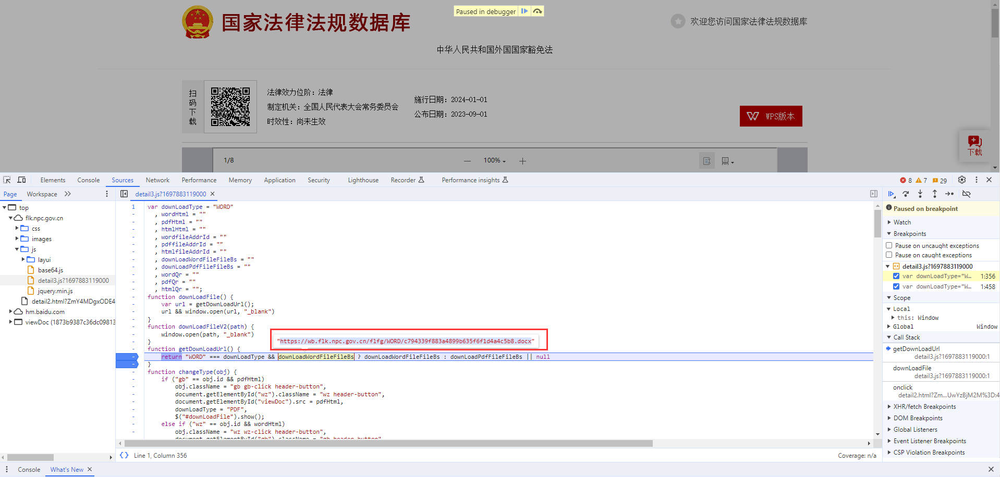

# LegalDoc-Scraper
Developed a comprehensive solution to automate the retrieval and download of legal documents. This tool significantly enhanced operational efficiency by enabling bulk processing of documents, facilitating a faster workflow.

# Environment Used

- Python 3.8
- Pycharm

# Modules Used
**requests**: providing a simple API for sending and receiving HTTP requests
```bash
pip install requests
```

# Data Source Analysis
**The Scraped Website URL**: https://flk.npc.gov.cn/fl.html

**Developer Tools**: Analyzing data packets to fetch dynamic or encrypted webpage information

`1) Navigate to the first item on the first page. On the right, there's a 'Download' button. Clicking it will automatically initiate the download for the corresponding document`


`2) Right-click and select 'Inspect' to locate the link method for the 'Download' button: downLoadFile()`


`3) Refresh the webpage. Search for downLoadFile() within the 'Network' panel to locate the corresponding JavaScript code`


`4) Right-click and choose ‘Open in Sources panel’. By setting breakpoints and debugging, you can directly find the download link (https://wb.flk.npc.gov.cn/flfg/WORD/c794339f883a4899b635f6f1d4a4c5b8.docx) after clicking the 'Download' button`



`5) Search for the key term c794339f883a4899b635f6f1d4a4c5b8 within the 'Network' panel. This will allow you to directly locate the data packet for the document, which includes the document title and a portion of the download link`


`6) From the 'Headers' section, we can deduce that the data packet is sending a POST request (https://flk.npc.gov.cn/api/detail). From the 'Payload' section, we can know that The parameter required by 'data' is the document ID (ZmY4MDgxODE4YTIxZGMxMzAxOGE1MTMyOGUwYzBjM2M%3D)`


<br>


`Therefore, by collecting all the document IDs and sending all POST requests, you can achieve bulk downloads.`

# Contributing
If you want to contribute to this project, please fork this repository and create a pull request, or drop me an email at kha112@sfu.ca
